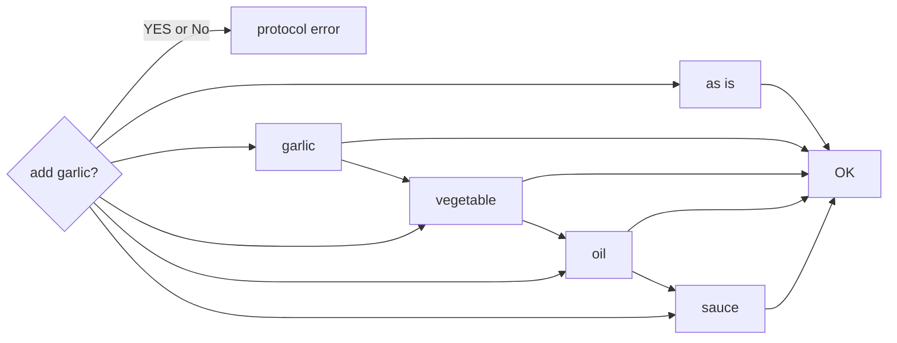
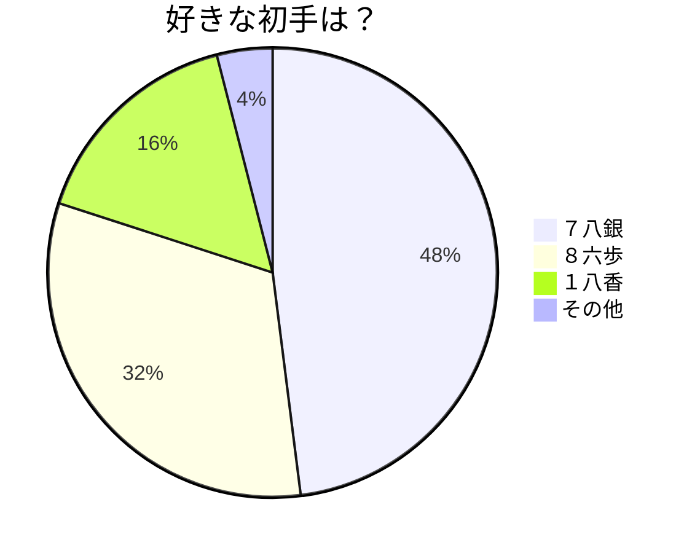

# mermaid-sample

## jiro flow

## questionnaire of first move of shogi

堂々の1位は７八銀となった。 
△３四歩に対して▲７六歩と突けなくなる最悪の初手である。 

そこで▲６六歩と指す手がある。これに対して、 
1) △同角には▲６八飛とパックマン戦法に切り替えていく
2) △８四歩には▲７六歩と突いて通常の将棋に戻すこともできる

といった指し方があり、最悪の初手と言われながらも意外と指せるかもしれない、味わい深い初手と言えよう。

2位の初手８六歩は後手が８筋を伸ばすと飛車先の歩を切られることを免れない最悪の初手である。 
しかしながら▲７八金と上がっておくことにより1歩損するわけでもないためすぐに悪くなることはないだろう。後手側からこの手を咎め文字数
